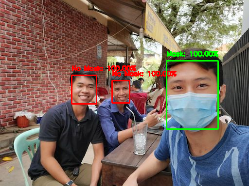

# Face Mask Detection with OpenCV

A simple face mask detection application with OpenCV.

We use 2 pre-trained models of face detection and face-mask classification.

Then, we use OpenCV to run the model inference.


### Installing

Download the project
``` shell script
git clone https://github.com/ishin-pie/face-mask-opencv.git
```

Install requirements.txt

``` shell script
cd face-mask-opencv
pip install -r requirements.txt
```

### Running demo

Image detection
``` shell script
python image.py -i demo/image.jpg 
```

Camera detection
``` shell script
python camera.py
```

### Result



### Acknowledgments

* https://www.pyimagesearch.com/2020/05/04/covid-19-face-mask-detector-with-opencv-keras-tensorflow-and-deep-learning/
* https://github.com/chandrikadeb7/Face-Mask-Detection.git
